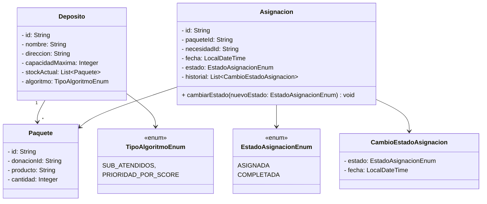

# DCL - FachadaLogística

```mermaid
classDiagram

%% =====================
%% ENTIDADES DE DOMINIO
%% =====================
class Deposito {
  - id: String
  - nombre: String
  - direccion: String
  - capacidadMaxima: Integer
  - stockActual: List~Paquete~
  - algoritmo: TipoAlgoritmoEnum
}

class Paquete {
  - id: String
  - donacionId: String
  - producto: String
  - cantidad: Integer
}

class Asignacion {
  - id: String
  - paqueteId: String
  - necesidadId: String
  - fecha: LocalDateTime
  - estado: EstadoAsignacionEnum
  - historial: List~CambioEstadoAsignacion~

  + cambiarEstado(nuevoEstado: EstadoAsignacionEnum) void
}

class EstadoAsignacionEnum {
  <<enum>>
  ASIGNADA
  COMPLETADA
}

class CambioEstadoAsignacion {
  - estado: EstadoAsignacionEnum
  - fecha: LocalDateTime
}

class TipoAlgoritmoEnum {
  <<enum>>
  SUB_ATENDIDOS,
  PRIORIDAD_POR_SCORE
}

%% =====================
%% RELACIONES
%% =====================
Deposito "1" --> "*" Paquete
Deposito --> TipoAlgoritmoEnum

Asignacion --> Paquete
Asignacion --> EstadoAsignacionEnum
Asignacion --> CambioEstadoAsignacion
```
